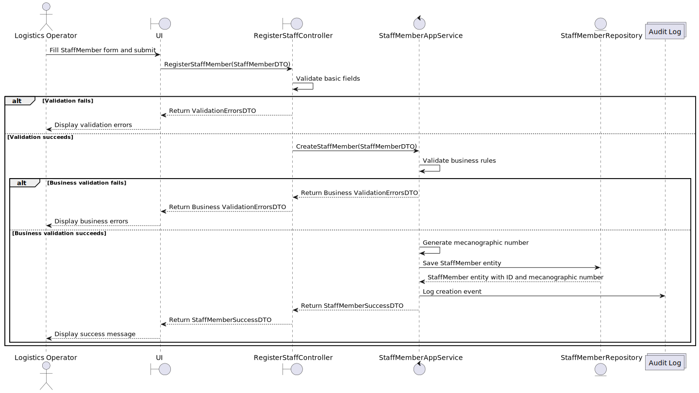
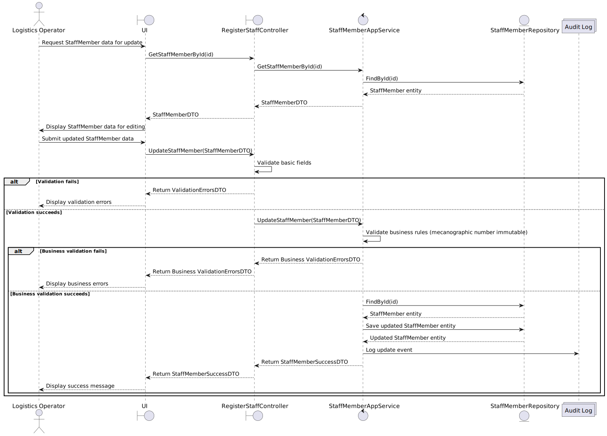

Here is the requested text in English, with an explanation:

# US2.2.11 – 

## 3. Design – User Story Realization

### 3.1. Rationale

This design section explains how the core functionality of registering, updating, and deleting operational team members will be realized from the perspective of user interaction with the system. It focuses on the coordination of application layers — UI, Controller, Service, Repository — and how data is validated, processed, persisted, and audited throughout this process.

The aim is to ensure clear separation of concerns, robust error handling, data integrity maintenance, and a workflow that is straightforward for the logistics operator to use.

The design reflects best practices for building maintainable, testable, and scalable applications by explicitly defining responsibilities and interactions between layers.

---

### 3.2. Sequence Diagram (SD)

This section will provide three distinct sequence diagrams, representing the main CRUD operations involved in the use case:

1. **Create**: The process of registering a new Staff Member. This includes validation of input fields provided by the user, automatic generation of the unique mecanographic number by the system, saving the new entity in the database, and recording audit logs to track the creation event.

2. **Update**: The process for modifying an existing Staff Member's data. It involves retrieving the current record, validating the changed data, enforcing that the mecanographic number remains unchanged, persisting the updates, and logging the changes for auditing purposes.

3. **Delete**: The procedure to deactivate or logically remove a Staff Member. This uses a soft delete approach, marking the entity as inactive rather than physically deleting it from the database to preserve historical records. The deletion action is also logged for auditing.

Each diagram will illustrate method calls and data flow across system layers, highlighting decision points and ensuring that business rules are enforced systematically.

These diagrams offer a precise technical blueprint to guide the implementation and testing of this user story, promoting clarity, consistency, and a thorough understanding among development team members.

---

