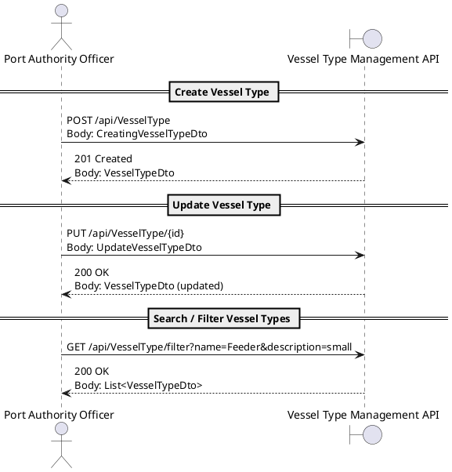

# **US2.2.1 – Create and Manage Vessel Types**

## 2. Analysis

---

### **2.1. Relevant Domain Model Excerpt**

**Explanation:**

* The **VesselType** aggregate represents a standardized definition of vessel configurations.
* Each `VesselType` has a **unique name**, descriptive text, and operational constraints (`maxRows`, `maxBays`, `maxTiers`) that determine its **maximum TEU capacity**.
* The **VesselTypeService** handles business logic for creation, update, and filtering, enforcing domain rules through the **VesselTypeRepository** and **BusinessRuleValidationException**.
* The **VesselTypeFactory** provides conversions between domain entities and data transfer objects (**DTOs**) used by the REST API layer.
* The **Vessel** aggregate (from another use case, US2.2.2) references `VesselType` to ensure consistency of capacity and structure.

---

### **2.2. Domain Concepts and Responsibilities**

| **Concept**                         | **Responsibility**                                                                                                |
| ----------------------------------- | ----------------------------------------------------------------------------------------------------------------- |
| **VesselType**                      | Aggregate Root representing a type of vessel, including name, description, capacity, and dimensional constraints. |
| **VesselTypeId**                    | Value Object encapsulating the unique identifier (UUID) for a `VesselType`.                                       |
| **VesselTypeFactory**               | Creates and maps between `VesselType` entities and DTOs.                                                          |
| **IVesselTypeRepository**           | Interface for retrieving, filtering, and persisting `VesselType` aggregates.                                      |
| **VesselTypeService**               | Application Service responsible for orchestration of business logic (validation, filtering, persistence).         |
| **VesselTypeController**            | API layer exposing REST endpoints to manage vessel types (`GET`, `POST`, `PUT`, `FILTER`).                        |
| **BusinessRuleValidationException** | Exception representing domain rule violations (e.g., invalid capacity, duplicate name).                           |

---

### **2.3. Invariants and Business Rules**

| **Rule ID** | **Description**                                                                                                     |
| ----------- | ------------------------------------------------------------------------------------------------------------------- |
| **R1**      | `Name` must be **unique** (case-insensitive) across all `VesselType` instances.                                     |
| **R2**      | `Description` length must be between **10** and **200** characters.                                                 |
| **R3**      | `MaxRows`, `MaxBays`, and `MaxTiers` must be **positive integers**.                                                 |
| **R4**      | `Capacity` is automatically computed as `MaxRows × MaxBays × MaxTiers`.                                             |
| **R5**      | A `VesselType` cannot be updated if doing so would **break referential integrity** with existing `Vessel` entities. |
| **R6**      | When updating `Name`, the new name must not already exist in the system.                                            |
| **R7**      | Search/filter must return all VesselTypes that partially match the input filters (`LIKE` semantics).                |

---

### **2.4. Input and Output Data**

**Input Data (from API / form submission):**

* `name : string` – required, unique, ≤ 50 chars
* `description : string` – optional but min. 10 chars
* `maxBays : int` – must be > 0
* `maxRows : int` – must be > 0
* `maxTiers : int` – must be > 0

**Output Data:**

* **On success (Create/Update):**
  Returns a `VesselTypeDto` containing all vessel type attributes and computed capacity.
* **On error:**
  Returns structured messages like:
  `"Name already exists."`, `"Description too short."`, `"MaxBays must be > 0."`

---

### **2.5. Behavioral Rules (Scenarios)**

| **Scenario**                     | **Preconditions**                   | **Action**                              | **Expected Result**                            |
| -------------------------------- | ----------------------------------- | --------------------------------------- | ---------------------------------------------- |
| **Create new VesselType**        | No existing type with the same name | Officer submits creation form           | VesselType created and persisted               |
| **Duplicate name on create**     | A type with same name exists        | Officer submits creation                | System rejects and shows “Name already exists” |
| **Update VesselType dimensions** | Type exists and valid               | Officer modifies `maxRows` / `maxTiers` | Capacity recalculated and entity saved         |
| **Invalid values**               | Negative or zero dimensions         | Officer submits form                    | System rejects with validation message         |
| **Search by description**        | Types exist in DB                   | Officer searches “feeder”               | All matching VesselTypes returned              |
| **No results in filter**         | DB contains none                    | Officer filters “invalid name”          | System returns “No Vessel Types Found”         |

---

### **2.6. System Sequence Diagram (SSD)**

#### **Alternative 1 – Create / Update / Search**

---

### **2.7. Other Remarks**

* **Auditability:** All create/update operations are logged with timestamp, officer ID, and success/failure status.
* **Search optimization:** The repository will use indexed text search for `Name` and `Description` fields.
* **Deletion:** Not implemented in this iteration; may be introduced as soft-delete in future sprints.
* **Error Handling:** Standardized using `BusinessRuleValidationException` and logged by the application service.
