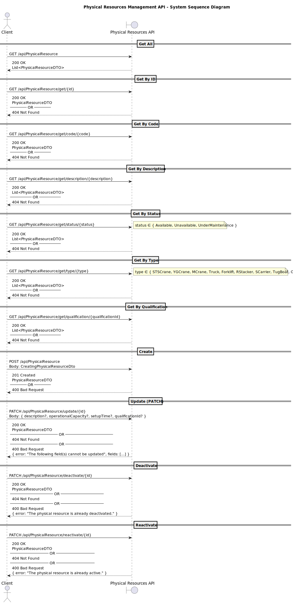

# US 2.2.12 – Register and Manage Physical Resources

## 1. Requirements Engineering

### 1.1. User Story Description

As a **Logistics Operator**, I want to **register and manage physical resources** (create, update, deactivate, and reactivate) so that they can be **accurately tracked and utilized** during port **planning and scheduling operations**.

---

### 1.2. Customer Specifications and Clarifications

**From the specifications document and client meetings:**

> Physical resources include **cranes, trucks, forklifts, and other operational equipment** used in port and yard operations.  
> Each resource must have a **unique alphanumeric code** (`CODE`), a **description**, and an associated **type** (e.g., Truck, Crane).  
> Resources must also store:
> - **Setup time** (if applicable);
> - An optional **qualification requirement**, ensuring that only certified staff can operate specific equipment.

> **Deactivation** and **reactivation** must preserve all data and ensure auditability for operational traceability.

**From forum (clarifications):**

> **Question:** Dear Client, in what unit is the setup time expressed?
> **Answer:** Across the entire system, data related with time must be record internally in the same time unit: seconds.
However, for input/output purpose, time values should be requested/presented in a format easing the user readability.

> **Question:**When creating a physical resource, should its status be automatically assigned to available or should the Logistics Operator choose it.  
> **Answer:** By default, it can be available.

> **Question:** Is there any constraints in terms of number of characteres for description?  
> **Answer:** Description: 255 chars max.

---

### 1.3. Acceptance Criteria

* **AC01 – Create:** System allows creation of a `PhysicalResource` with `Code`, `Description`, `Type`, `OperationalCapacity`, optional `SetupTime`, and optional `QualificationId`.
* **AC02 – Retrieve:** System supports retrieval of physical resources by `ID`, `Code`, `Description`, `Type`, `Status`, or `QualificationId`.
* **AC03 – Update:** System allows updating fields such as `Description`, `OperationalCapacity`, `SetupTime`, and `QualificationId`.
* **AC04 – Deactivate:** System allows deactivating a resource, changing its status to `Unavailable`.
* **AC05 – Reactivate:** System allows reactivating a previously deactivated resource, restoring its status to `Available`.
* **AC06 – Uniqueness:** Resource `Code` must be unique across the system.

---

### 1.4. Found Out Dependencies

* **Depends on:**
    * US 2.2.13 – *Register and Manage Qualifications*, since `QualificationId` is a foreign reference.

* **Provides data to:**
    * Planning and Scheduling modules that allocate physical resources to operations.

---

### 1.5. Input and Output Data

#### **Input Data (API Request Examples)**

| Field | Type | Required | Description |
|-------|------|-----------|--------------|
| `description` | string | ✅ Yes | Resource description (max 80 chars). |
| `physicalResourceType` | enum | ✅ Yes | Type of resource (e.g., `Truck`, `Crane`, `Forklift`). |
| `operationalCapacity` | double | ✅ Yes | Operational capacity; must be > 0. |
| `setupTime` | double | ✅ Yes | Time required to prepare the resource; must be > 0. |
| `qualificationCode` | string | ❌ No | Optional qualification reference. |

#### **Output Data**

| Field | Type | Description |
|-------|------|--------------|
| `id` | Guid | Unique identifier of the physical resource. |
| `code` | string | Generated unique alphanumeric code. |
| `description` | string | Description of the resource. |
| `type` | string | Resource category (Truck, Crane, etc.). |
| `status` | string | Current status of the resource. |
| `operationalCapacity` | double | Operational performance metric. |
| `setupTime` | double | Setup time before operation. |
| `qualificationId` | Guid (nullable) | Qualification required for operation. |

---

### 1.6. System Sequence Diagram (SSD)

---

### 1.7. Other Relevant Remarks

- None