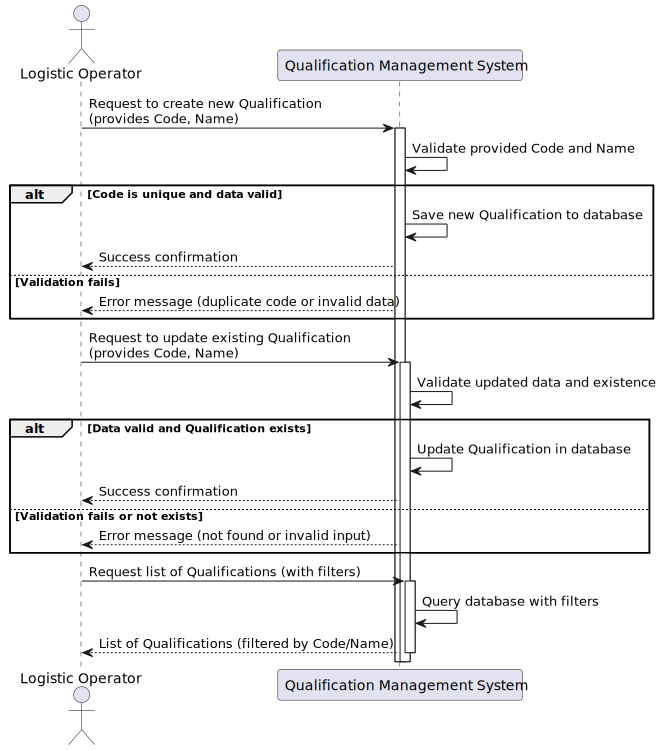

# US 2.2.13 - Register and Manage Qualifications

## 1. Requirements Engineering

### 1.1. User Story Description

As a Logistics Operator, I want to register and manage qualifications (create, update) so that staff members and resources can be consistently associated with the correct skills and certifications required for port operations.

### 1.2. Customer Specifications and Clarifications

**From the specifications document and client meetings:**

> Qualifications must have a unique code and descriptive name to allow quick identification and filtering during port operations.  
> They serve as prerequisites for assigning tasks and resources inside the logistics system.

**From forum:**

> **Question:** When performing an update, is it possible to change the code, the name, or both?
> **Answer:** Both are updatable. However, you need to ensure that:
    1. The code remains unique;
    2. Existing relationships of either resources and/or staff to qualifications must remain valid.

### 1.3. Acceptance Criteria

* **AC01:** It must be possible to create a new qualification with required code and name.
* **AC02:** The qualification code must be unique and validated on creation or update.
* **AC03:** It must be possible to update the code and name of an existing qualification.
* **AC04:** The qualification list must allow searching and filtering by code and name.
* **AC05:** The system must prevent assigning unregistered qualifications to staff or resources.

### 1.4. Found Out Dependencies

* None directly. Authentication and authorization modules may be dependencies to control access.

### 1.5. Input and Output Data

**Input Data:**

| Field | Type   | Required | Description                  |
|-------|--------|----------|------------------------------|
| Name  | string | Yes      | Descriptive name             |

**Output Data:**

| Field | Type   | Description                         |
|-------|--------|-----------------------------------|
| Code  | string | Qualification code                 |
| Name  | string | Qualification name                 |

### 1.6. System Sequence Diagram (SSD)

### 1.7 Other Relevant Remarks

> Managing qualifications is fundamental to ensure correct attribution of skills to port tasks and resources, ensuring compliance and operational safety.
