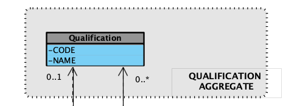

# US 2.2.13 - Register and Manage Qualifications

## 2. Analysis

### 2.1. Relevant Domain Model Excerpt 

The Qualification aggregate consists of a Qualification entity with two main attributes:
- `CODE`: the unique alphanumeric identifier for the qualification.
- `NAME`: a descriptive name for the qualification.

A qualification can exist independently and be referenced by staff members or resources. The model supports zero or one qualification per entity, and zero or many qualifications per aggregate.

### 2.2. Other Remarks

n/a