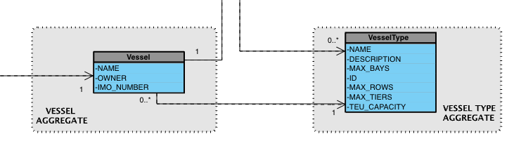

## 2. Analysis

### 2.1. Relevant Domain Model Excerpt

**Concepts identified:**

* **Vessel (Aggregate Root)**

  * Attributes:

    * `Id` (surrogate key – `VesselId`).
    * `IMO` (`ImoNumber` VO – natural key).
    * `Name`.
    * `Owner` (operator/owner name).
    * `VesselTypeId` (foreign key reference to `VesselType`).
  * Behaviors (methods):

    * `UpdateName(name)` – validates min length.
    * `UpdateOwner(owner)` – validates min length.
    * `UpdateImoNumber` and `UpdateVesselType` exist mas são privados → não acessíveis fora do aggregate.

* **ImoNumber (Value Object)**

  * Ensures correct format: 7 digits, last is check digit.
  * Validation occurs at construction.
  * Immutable once created.

* **VesselType (Entity / Aggregate Root)**

  * Defined in **US2.2.1**.
  * Referenced by Vessel through `VesselTypeId`.
  * Must exist when a Vessel is registered.

* **Owner/Operator (simple property, currently a string)**

  * Business rule: minimum length 5, not null or whitespace.
  * Candidate for future VO or Entity if operators become first-class in the domain (see dependency with US2.2.5).

---

**Invariants and business rules:**

* A `Vessel` must always have:

  * Valid `IMO` at creation.
  * Non-empty `Name` (≥5 chars).
  * Non-empty `Owner` (≥5 chars).
  * Valid `VesselTypeId` (not empty GUID, must exist).
* `IMO` is immutable → cannot be updated once set.
* No duplicate IMO numbers allowed (enforced in `VesselService` before creation).
* Updates are restricted to `Name` and `Owner`.
* Referential integrity: Vessel always linked to an existing VesselType.

---

### 2.2. Other Remarks

* `ImoNumber` VO encapsulates both **validation** and **uniqueness check digit** logic.
* Search operations (`GetByImo`, `GetByName`, `GetByOwner`, `GetFilter`) are handled at **application service** level and not modeled in the aggregate.
* Logging: both `VesselService` and `VesselController` use structured logging (`ILogger`) for traceability of CRUD operations.
* Exception handling:

  * Invalid input or business rule violation → `BusinessRuleValidationException`.
  * Propagated as `400 Bad Request` or `404 Not Found` in the API layer.
* Future US may extend with additional vessel details (flag, dimensions, tonnage, status, soft-delete).

---

