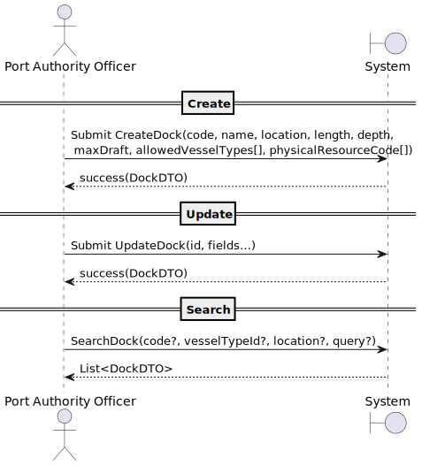

# US2.2.3 – Register and update docks

## 1. Requirements Engineering

### 1.1. User Story Description

> As a Port Authority Officer, I want to register and update docks so that the system accurately reflects the docking capacity of the port.

**Preconditions**

* Officer is authenticated and authorized.
* The “Port Registry” module is available.
* At least one VesselType exists (for berth constraints).

**Postconditions**

* A new **Dock** is persisted or an existing one is updated.
* Docks are available for future reference in vessel visit scheduling and assignments.
* All changes are logged for accountability.

---

### 1.2. Customer Specifications and Clarifications

**From forum**

> **Q:** Regarding this user story, can you confirm if a dock supports only one vessel type?
> 
> **A:** No! That is clearly wrong.
An acceptance criteria states that "The officer must specify the vessel types allowed to berth there.".
On a given dock may berth several vessel types (e.g. Feeder and Panamax).

> **Q** Regarding the user story for registering and updating a dock, we are not sure what is meant by "location within the port." Should this be stored as geographic coordinates, or as a relative/semantic position (e.g., area, zone) within the port?
> 
> **A** In this case, you may consider the "location within the port" as a free text.
---

### 1.3. Acceptance Criteria

* **AC01 – Create: The system shall allow registering a new Dock with all required attributes: DockCode, location, physical dimensions (length, depth, max draft), allowed vessel types, and optionally, physical resource codes (PRCs).
* **AC02 – Update: The system shall allow updating existing Dock details, including DockCode, location, physical dimensions, physical resource codes, allowed vessel types, and status.
* **AC03 – Uniqueness: Each DockCode must be unique. Each PhysicalResourceCode (PRC) must also be globally unique and must not belong to more than one dock.
* **AC04 – Validation (dimensions): length > 0, depth > 0, maxDraft > 0; error shown if invalid.
* **AC05 – Reference Availability: Newly created or updated docks must be immediately available for vessel visit scheduling and assignment.
* **AC06 – Search/Filter: Users shall be able to search or filter docks by dockCode, location, vessel type, and physical resource codes.
* **AC07 – Referential Integrity: Updates to docks shall not compromise existing or scheduled vessel visit assignments.
* **AC08 – Audit: All create and update actions shall be logged with timestamp, user (officer) identity, and action outcome.
* **AC09 – Error Handling: On validation errors, the system shall provide clear and actionable error messages. No partial or inconsistent dock data shall be saved.

---

### 1.4. Found out Dependencies

* **Depends on:** Authentication/Authorization (role: Port Authority Officer).
* **Provides to:** Vessel Visit Scheduling (dock assignment).
* **Cross-cutting:** Audit/Logging, Search API.

---

### 1.5. Input and Output Data

**Input Data (Create/Update form or API):**

* `dockCode : string` *(required, unique)*
* `location : string` *(required)*
* `length : number > 0`
* `depth : number > 0`
* `maxDraft : number > 0`
* `physicalResourceCodes[]  – list<string>
* `allowedVesselTypeIds[]   – list<VesselTypeId>
* `status` : Defaults to Available

**Output Data:**

* On success: Persisted Dock data (ID, all fields, status, timestamps if available).
* On failure: Error list with descriptive messages (“DockCode already exists”, “Depth must be > 0”).
* For search: List of docks {id, code, location, allowedVesselTypes, status} with filtering metadata.

---

### 1.6. System Sequence Diagram (SSD)

