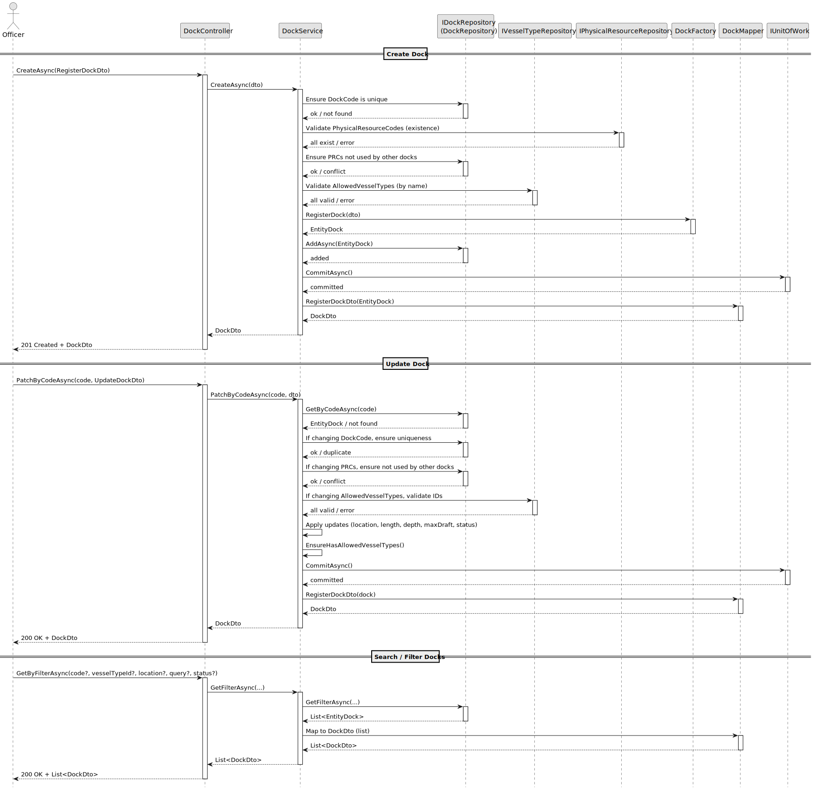
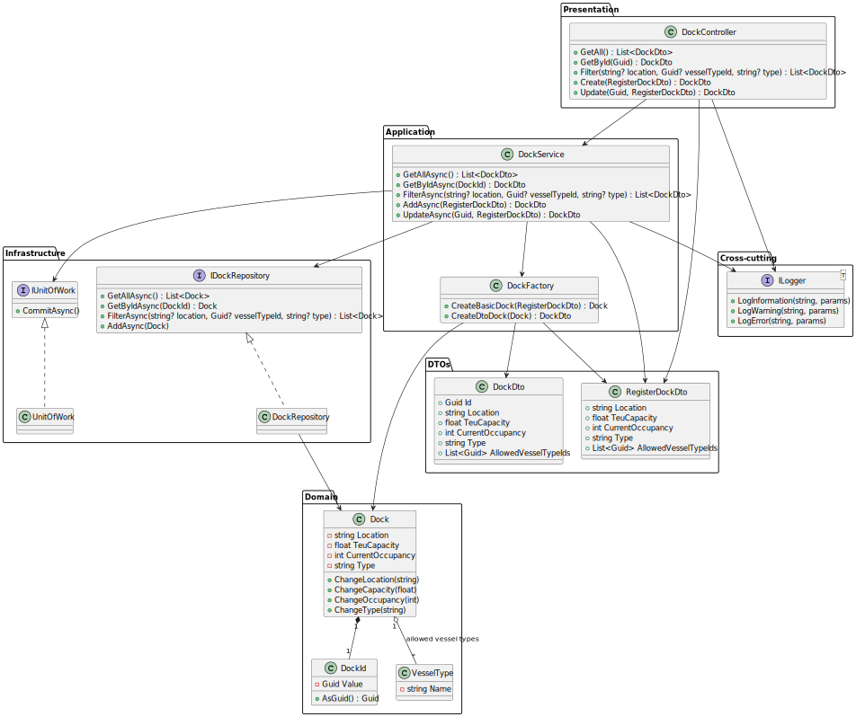

# US2.2.3 – Register and update docks

## 3. Design – User Story Realization

### 3.1. Rationale

This section explains **which software class takes responsibility** for each interaction step, following the SSD (System Sequence Diagram) defined in the analysis.

| Interaction ID                                              | Question: Which class is responsible for... | Answer                                | Justification (with patterns)                                                                                       |
|-------------------------------------------------------------| ------------------------------------------- |---------------------------------------| ------------------------------------------------------------------------------------------------------------------- |
| Step 1: Officer submits “Register/Update Dock”              | …interacting with the actor?                | `DockController`                      | **Controller** pattern: centralizes input handling from UI/API.                                                     |
|                                                             | …coordinating the US?                       | `DockService`                         | **Application Service**: orchestrates domain logic and delegates to the domain model + repository + factory.        |
| Step 2: request data (id/name, location, physical characteristics, allowed vessel types) | …validating business rules?                 | `Dock` (Aggregate Root)               | **Information Expert**: the aggregate enforces its invariants (e.g., required identifiers/attributes; association to allowed vessel types). Acceptance criteria: each dock has a unique identifier, name/number, location, physical characteristics; officer specifies allowed vessel types. |
|                                                             | …transforming DTOs into Entities/DTOs?      | `DockFactory`                   | **Factory**: centralizes creation of entities and DTOs, avoiding duplication of conversion logic.                   |
| Step 3: persist Dock                                  | …storing/retrieving VesselType?             | `DockRepository` + `UnitOfWork` | **Repository**: abstracts persistence and provides access to aggregates. **UnitOfWork**: guarantees atomic commits. |
| Step 4: log action                                          | …recording audit trail?                     | `ILogger` (Serilog)                   | **Pure Fabrication**: dedicated logging mechanism for cross-cutting concerns (audit, monitoring, debugging).        |

**Systematization**
According to this rationale, the conceptual classes promoted to software classes are:

* `Dock` (Aggregate Root)

Other software classes (i.e., Pure Fabrication) identified:

* `DockController`
* `DockService`
* `DockFactory`
* `DockRepository`
* `UnitOfWork`
* `ILogger` (logging / audit)

---

### 3.2. Sequence Diagram (SD)
This diagram illustrates the interactions between the classes for realizing the user story.

**Full Diagram:**

---

### 3.3. Class Diagram (CD)
The class diagram for this US includes:

* `Dock` (Aggregate Root with attributes indicated by the US: dockId (unique), nameOrNumber, location, length, depth, maxDraft, and an association to allowed VesselType).
* `DockController` (handles requests from UI/API).
* `DockAppService` (orchestrates the use case, including search/filter by name, vessel type, location).
* `DockRepository` (persistence abstraction).
* `AuditService` (responsible for audit logging).

