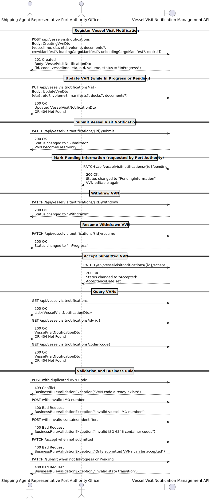

# US2.2.8 – Create and Submit Vessel Visit Notification

## 1. Requirements Engineering

### 1.1. User Story Description

> **As a Shipping Agent Representative,**
> I want to create and submit a **Vessel Visit Notification (VVN)**,
> so that the vessel berthing and subsequent (un)loading operations at the port are **scheduled and planned in a timely manner**.

---

### 1.2. Customer Specifications and Clarifications

**From the specifications document and client meetings:**

> • Each Vessel Visit Notification must have a unique business identifier following the format `{YEAR}-{PORT_CODE}-{SEQUENTIAL_NUMBER}`,
> where:
>
> * **YEAR:** the calendar year when the visit is first registered.
> * **PORT_CODE:** an alphanumeric code uniquely identifying the port (e.g., *PTLEI* for Porto de Leixões).
> * **SEQUENTIAL_NUMBER:** a zero-padded integer (e.g., 000001, 000002, ...).
>
> • The combination (YEAR, PORT_CODE, SEQUENTIAL_NUMBER) must be **unique** across the system.
> • Once assigned, the identifier must remain **immutable**, even if other details (dates, vessel, manifests) are updated.
> • The **Cargo Manifest data** for loading/unloading must be included or referenced.
> • The system must validate that all **container identifiers** comply with the **ISO 6346:2022** standard.
> • Crew information (name, citizen ID, nationality) might be required for security compliance.
> • A Vessel Visit Notification can remain in **“In Progress”** status while incomplete.
> • When ready, the representative must **submit** it for approval.
> • Once submitted, it cannot be changed by the shipping agent, except if the port authority requests updates — in that case, the VVN becomes **“Pending Information.”**
> • If the agent decides not to continue with a draft, they can **withdraw** it. Withdrawn VVNs are not deleted, as they may later be **resumed**.

**From forum:**

> **Question:** Can a Vessel Visit Notification be edited after submission?
> **Answer:** No, except when the port authority marks it as *Pending Information*, allowing updates for resubmission.

---

### 1.3. Acceptance Criteria

* **AC01:** The system must allow the creation of a new VVN with vessel, ETA/ETD, cargo, and crew details.
* **AC02:** Each new VVN must generate a unique business code following the `{YEAR}-{PORT_CODE}-{SEQUENTIAL_NUMBER}` format.
* **AC03:** A VVN can be saved in the **“In Progress”** state and updated freely until submission.
* **AC04:** When submitted, the VVN’s status changes to **“Submitted”** and becomes read-only.
* **AC05:** A **Submitted** VVN may later be changed to **“Pending Information”** by the authority if corrections are needed.
* **AC06:** When in **Pending Information**, the agent can edit and resubmit the VVN.
* **AC07:** The agent can **withdraw** a VVN in *In Progress* or *Pending* states.
* **AC08:** A withdrawn VVN can be **resumed** (returning to *In Progress*).
* **AC09:** A submitted VVN can be **accepted** by the port authority, recording the acceptance date.
* **AC10:** All cargo containers must have valid **ISO 6346** identifiers.
* **AC11:** All times (ETA, ETD, ATA, ATD) must follow a valid date-time format and belong to the `ClockTime` value object.
* **AC12:** Once accepted, the VVN and its associated manifests become immutable.

---

### 1.4. Found Out Dependencies

* **US2.2.9 – Manage Vessel Visit Notification State**
  (related to withdrawal, resumption, and pending status management).
* **US2.2.6 – Manage Cargo Manifests**
  (VVNs reference loading/unloading manifests).
* **US2.2.7 – Manage Crew Manifest**
  (VVNs reference crew details).
* **US2.2.5 – Register Vessel**
  (VVNs link to a specific vessel via its IMO number).

---

### 1.5. Input and Output Data

**Input Data:**

* Vessel details (IMO number, name)
* Estimated Time of Arrival (ETA)
* Estimated Time of Departure (ETD)
* Cargo Manifests (Loading/Unloading)
* Crew Manifest
* List of Docks involved
* Volume (numeric, non-negative)
* Optional documents (text or file references)

**Output Data:**

* Created Vessel Visit Notification with:

    * Unique VVN Code (`{YEAR}-{PORT_CODE}-{SEQUENTIAL_NUMBER}`)
    * Current Status (`InProgress`, `PendingInformation`, `Submitted`, `Withdrawn`, `Accepted`)
    * Acceptance Date (if applicable)
    * Associated Crew/Cargo data
    * Confirmation message (`201 Created` or `200 OK`)

---

### 1.6. System Sequence Diagram (SSD)

### 1.7. Other Relevant Remarks

> • The VVN entity enforces business invariants at the domain level (e.g., non-negative volume, immutable code, valid time objects).
> • All date-time fields use the **`ClockTime`** value object for validation and formatting.
> • The VVN’s life cycle is managed through methods in the aggregate root (`Submit()`, `MarkPending()`, `Withdraw()`, `Resume()`, `Accept()`).
> • The system logs all state transitions for traceability.
> • The port authority can interact with VVNs from the **Submitted** or **Pending** states only.
> • Once accepted, the VVN becomes read-only and archived for operational reference.
