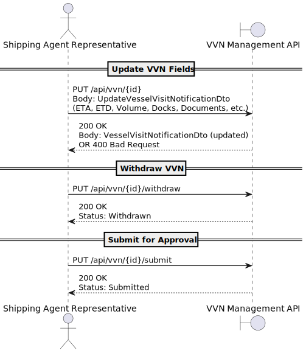

# **US2.2.9 – Update or Complete Vessel Visit Notification**

---

## **1. Requirements Engineering**

### **1.1. User Story Description**

> **As a Shipping Agent Representative**,
> I want to **change or complete a Vessel Visit Notification** while it is still *In Progress*,
> so that I can **correct errors or submit the request for approval** when ready.

---

### **1.2. Customer Specifications and Clarifications**

From the *specification document* and *client meetings*:

> While the status of the Vessel Visit Notification (VVN) is **In Progress**,
> the Shipping Agent Representative can modify **any data** — including ETA, ETD, Volume, Documents, Docks, Crew Manifest, and Cargo Manifests.
>
> Once the VVN is **Submitted**, it **cannot be edited anymore** by the Shipping Agent Representative.
>
> Only the Port Authority may later mark it as “Pending Information”, reopening it for correction.

> The representative can also **withdraw** a VVN that is still *In Progress* or *Pending Information*, changing its status to *Withdrawn*.

From *forum discussions*:

> **Question:** Can a representative re-edit a VVN marked as pending information?
> **Answer:** Yes, the representative can update and re-submit it while it’s *Pending Information*.

---

### **1.3. Acceptance Criteria**

| ID       | Criteria          | Description                                                                                                                 |
| -------- | ----------------- | --------------------------------------------------------------------------------------------------------------------------- |
| **AC01** | Editable state    | A VVN can be updated only when its status is *In Progress* or *PendingInformation*.                                         |
| **AC02** | Status transition | When the representative chooses to finalize, the VVN status changes from *InProgress* → *Submitted*.                        |
| **AC03** | Data modification | While *In Progress*, all fields (ETA, ETD, Volume, Documents, Docks, CrewManifest, CargoManifests) can be changed or added. |
| **AC04** | Locked state      | Once *Submitted*, the VVN becomes read-only and cannot be modified by the Shipping Agent Representative.                    |
| **AC05** | Withdrawal        | The representative can withdraw a VVN while it’s *In Progress* or *PendingInformation*, changing its status to *Withdrawn*. |
| **AC06** | Resubmission      | A withdrawn VVN can be resumed (*InProgress*) and re-submitted for approval.                                                |
| **AC07** | API feedback      | The system returns `200 OK` with the updated VVN DTO, or `400 BadRequest` if validation fails.                              |

---

### **1.4. Found Out Dependencies**

* Depends on **US2.2.8 – Register Vessel Visit Notification**, since updates apply only to existing VVNs.
* Depends on **VesselVisitNotificationService** for handling domain logic and validation.
* Reuses domain methods:

    * `IsEditable`
    * `Submit()`
    * `Withdraw()`
    * `Resume()`
    * `MarkPending()`

---

### **1.5. Input and Output Data**

**Input Data**

* `VesselVisitNotificationId`
* `UpdateVesselVisitNotificationDto`

    * ETA / ETD (`ClockTime`)
    * Volume
    * Documents (optional)
    * Docks (list of dock codes)
    * CrewManifest (optional)
    * CargoManifests (optional)
    * Status (optional: `"Submit"` or `"Withdraw"`)

**Output Data**

* `VesselVisitNotificationDto` (updated state)
* Error messages (`400 BadRequest`) in case of invalid status or business rule violation.

---

### **1.6. System Sequence Diagram (SSD)**

#### **Main Scenario: Update and Submit VVN**

---

### **1.7. Other Relevant Remarks**

* Only **Shipping Agent Representatives** can perform this action.
* Once **Submitted**, the VVN is locked for editing by the representative.
* If the Port Authority marks it as “Pending Information”, the representative regains edit permissions.
* The same endpoint can handle both **update** and **submission**, based on the request payload.
* Business validation (ETA < ETD, valid docks, volume ≥ 0, etc.) is enforced by the domain layer.
