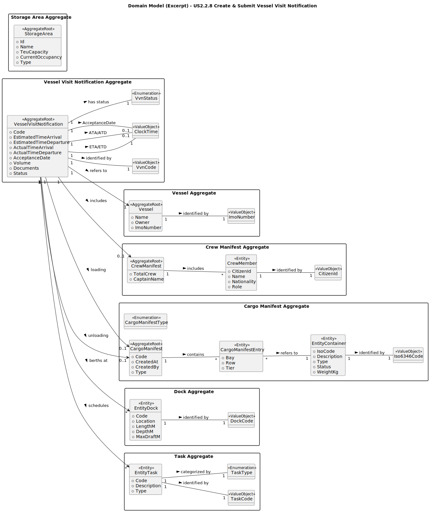

# **US2.2.9 – Update or Complete Vessel Visit Notification**

## **2. Analysis**

### **2.1. Relevant Domain Model Excerpt**



---

#### **Description of the Domain Model Excerpt**

The **VesselVisitNotification (VVN)** aggregate root represents the main entity responsible for managing all operational, temporal, and logistical data associated with a vessel’s visit to the port.
This entity is the **only aggregate allowed to be updated** by the **Shipping Agent Representative** while in the `InProgress` state.
It governs all transitions to `Submitted`, `Withdrawn`, `PendingInformation`, and `Accepted` through controlled domain operations.

---

#### **Main Entities and Value Objects**

* **VesselVisitNotification (Aggregate Root)**
  Central aggregate managing ETA/ETD, volume, documents, crew, cargo, and dock assignments.
  It enforces validation of states, edit permissions, and lifecycle transitions.

* **VvnCode (Value Object)**
  Unique business identifier for each VVN, following the pattern `{YEAR}-{PORT_CODE}-{SEQUENCE}`
  *(e.g., `2025-THPA-000003`)*.

* **ClockTime (Value Object)**
  Encapsulates and validates timestamp information (ETA, ETD, ATA, ATD, AcceptanceDate), ensuring logical chronological order.

* **EntityDock (Entity Reference)**
  Represents a physical dock used by the vessel during its port visit, linked through a `DockCode`.

* **CrewManifest (Aggregate Root)**
  Holds details about the vessel’s crew, including captain and crew members, which may be modified while the VVN is *InProgress*.

* **CargoManifest (Aggregate Root)**
  Contains detailed information about cargo loading and unloading operations.
  Each manifest references one or more `CargoManifestEntry` entities, which in turn reference `Container` entities.

* **VvnStatus (Enumeration)**
  Defines and controls the lifecycle state of the VVN:

  ```
  InProgress, PendingInformation, Withdrawn, Submitted, Accepted
  ```

---

#### **Relationships**

| **Relationship**                          | **Description**                                                                 |
| ----------------------------------------- | ------------------------------------------------------------------------------- |
| `VesselVisitNotification → Vessel`        | Links the VVN to a specific vessel (identified by `ImoNumber`).                 |
| `VesselVisitNotification → EntityDock`    | Associates the vessel visit with one or more docks for berthing operations.     |
| `VesselVisitNotification → CrewManifest`  | Optionally links a crew manifest, editable while *InProgress*.                  |
| `VesselVisitNotification → CargoManifest` | Optionally links manifests for *Loading* and *Unloading*.                       |
| `VesselVisitNotification → EntityTask`    | Associates operational tasks automatically generated upon acceptance or update. |

---

### **2.2. Business Rule Summary**

| **Rule ID**   | **Description**                                                                                                                                                 |
| ------------- | --------------------------------------------------------------------------------------------------------------------------------------------------------------- |
| **BR-VVN-01** | While the VVN is *InProgress*, all data (ETA, ETD, Volume, Documents, Docks, CrewManifest, CargoManifests) can be updated by the Shipping Agent Representative. |
| **BR-VVN-02** | Once *Submitted*, the VVN becomes read-only — no modifications are allowed.                                                                                     |
| **BR-VVN-03** | A VVN can only be *Withdrawn* if it is currently *InProgress* or *PendingInformation*.                                                                          |
| **BR-VVN-04** | A *Withdrawn* VVN may be *Resumed* (status → *InProgress*) and resubmitted.                                                                                     |
| **BR-VVN-05** | Updates must follow the same validation logic as creation (valid ETA/ETD, positive volume, valid docks, existing vessel by IMO).                                |
| **BR-VVN-06** | All status transitions are controlled by domain methods (`Submit()`, `Withdraw()`, `Resume()`, `MarkPending()`), ensuring consistent state transitions.         |
| **BR-VVN-07** | Only the Shipping Agent Representative who created the VVN can perform updates or submissions.                                                                  |

---

### **2.3. Other Remarks**

* The **`VesselVisitNotificationService`** acts as the **application service and coordinator**, validating the entity’s current status before performing any update or submission.
  It ensures that only valid operations are applied according to the business rules and current state.
* The **aggregate root (`VesselVisitNotification`)** enforces invariants:

  * Prevents modification of immutable data after submission.
  * Throws `BusinessRuleValidationException` when transitions or data updates violate business rules.
  * Maintains strict chronological and logical consistency between all timestamps (ETA, ETD, ATA, ATD).
* The **controller layer** exposes domain-specific endpoints for lifecycle operations:

  * `PUT /api/VesselVisitNotification/{id}` → Update while *InProgress*
  * `PUT /api/VesselVisitNotification/{id}/submit` → Submit and lock
  * `PUT /api/VesselVisitNotification/{id}/withdraw` → Withdraw
  * `GET /api/VesselVisitNotification/{id}` → Retrieve current status or review data
* The **`VvnStatus` enumeration** ensures state integrity and prevents invalid transitions such as skipping directly from *InProgress* to *Accepted*.

  ```
  InProgress → PendingInformation → Submitted → Accepted
  InProgress → Withdrawn → InProgress (Resume)
  ```
