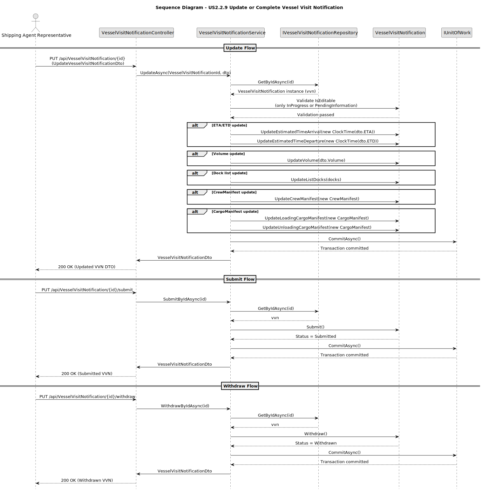
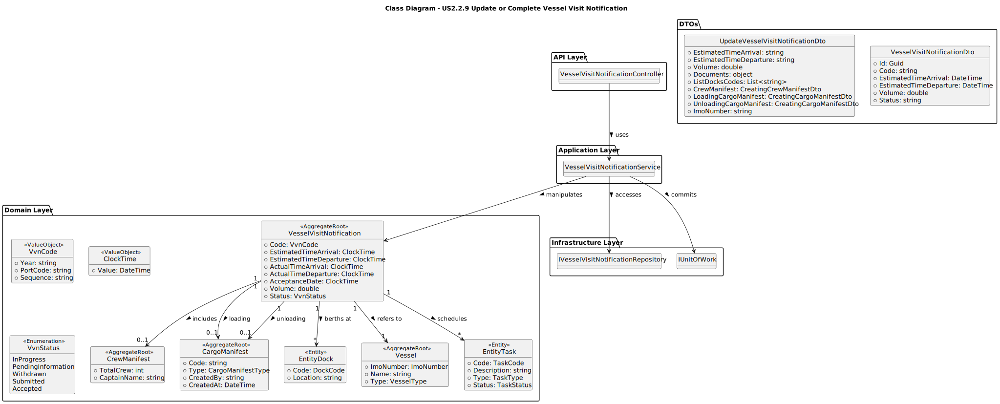

# **US2.2.9 – Update or Complete Vessel Visit Notification**

## **3. Design – User Story Realization**

### **3.1. Rationale**

***Note that SSD – Alternative One is adopted.***

| **Interaction ID** | **Question: Which class is responsible for…**                 | **Answer**                           | **Justification (with patterns)**                                                                                                              |
| :----------------- | :------------------------------------------------------------ | :----------------------------------- | :--------------------------------------------------------------------------------------------------------------------------------------------- |
| **Step 1**         | … interacting with the actor (Shipping Agent Representative)? | `VesselVisitNotificationController`  | **Controller pattern.** Handles the HTTP request and coordinates communication between the presentation and application layers.                |
| **Step 2**         | … coordinating the use case flow and applying business logic? | `VesselVisitNotificationService`     | **Application Service.** Orchestrates the update process, checking the current VVN status and delegating to domain logic methods.              |
| **Step 3**         | … verifying the current VVN state and validating transitions? | `VesselVisitNotification`            | **Aggregate Root.** Enforces domain invariants, validates updates, and performs controlled state transitions (`Submit()`, `Withdraw()`, etc.). |
| **Step 4**         | … accessing or persisting the updated entity?                 | `IVesselVisitNotificationRepository` | **Repository pattern.** Provides controlled persistence operations and entity retrieval from the data store.                                   |
| **Step 5**         | … committing changes to the data source?                      | `IUnitOfWork`                        | **Unit of Work pattern.** Ensures atomic transaction commits and maintains consistency across repositories.                                    |

---

### **Systematization**

According to the rationale, the following conceptual classes were promoted to software classes:

**Software Classes Identified**

* `VesselVisitNotificationController`
* `VesselVisitNotificationService`
* `VesselVisitNotification`
* `IVesselVisitNotificationRepository`
* `IUnitOfWork`

**Other Software Classes (Pure Fabrication)**

* DTOs (`UpdateVesselVisitNotificationDto`, `VesselVisitNotificationDto`)
* `BusinessRuleValidationException` (for enforcing domain constraints)

---

## **3.2. Sequence Diagram (SD)**

### **Full Diagram**

---

## **3.3. Class Diagram (CD)**

---

### **Design Summary**

* The **Controller** receives and interprets the HTTP requests.
* The **Service** coordinates the update process and ensures that the current status allows modification.
* The **Aggregate Root (`VesselVisitNotification`)** performs validation and applies business rules.
* The **Repository** handles persistence abstraction.
* The **Unit of Work** guarantees transactional integrity.
* All updates strictly follow the **DDD and Layered Architecture** principles used across the system.
