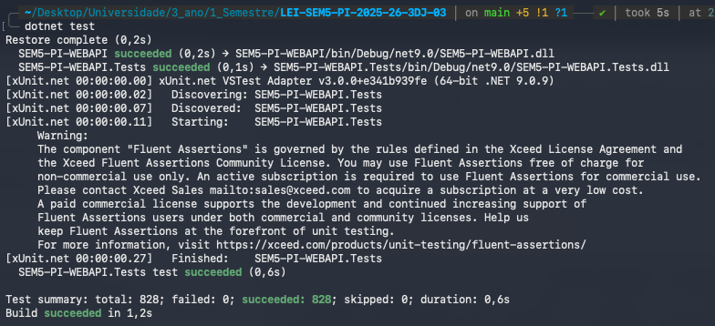
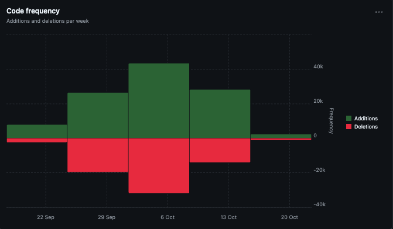
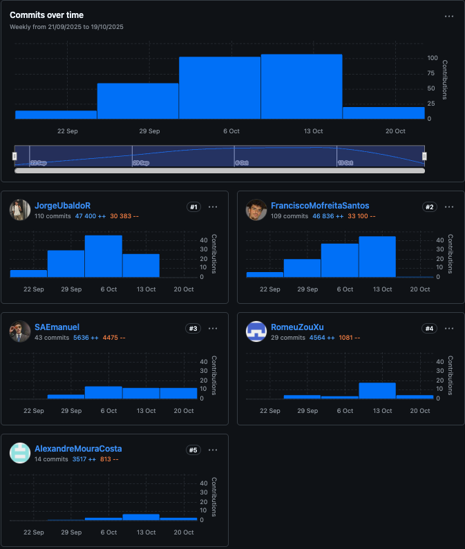
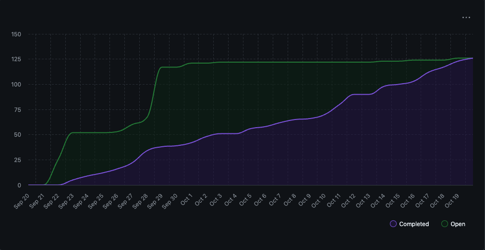
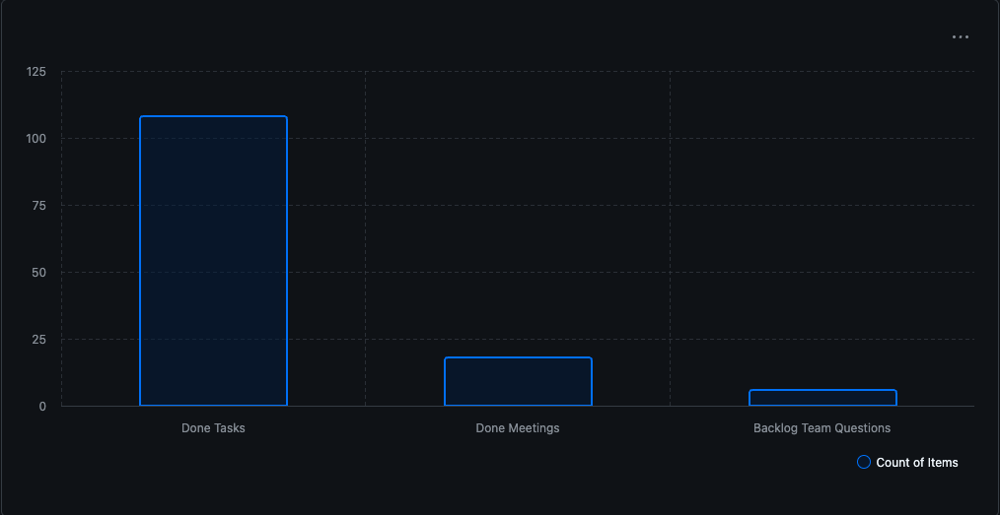

# Sprint 1 Retrospective & Review

### Projeto: Plataforma de Gestão Portuária (.NET 8 + ASP.NET Core + EF Core + DDD)

### Equipa: Jorge Ubaldo, Romeu Xu, Francisco Santos, Emanuel Almeida, Alexandre

### Período: 7 a 26 de Outubro de 2025

---

## Introdução

O presente documento apresenta a **Retrospectiva e Revisão do Sprint 1** do projeto *Plataforma de Gestão Portuária*, desenvolvido pela equipa 3DJ. Este sprint teve como objetivo consolidar a base técnica e estrutural do sistema, garantindo um incremento funcional, estável e escalável. Foram aplicadas práticas de **Scrum** aliadas a princípios sólidos de **engenharia de software** e **Domain-Driven Design (DDD)**, com foco em qualidade, colaboração e melhoria contínua.

O sprint decorreu entre **14 de setembro a 26 de outubro de 2025**, e as atividades abrangeram desde o planeamento e definição de objetivos até à implementação, testes, integração contínua e revisão. O documento reflete sobre o desempenho da equipa, as práticas adotadas e as lições aprendidas, com vista a otimizar futuros ciclos de desenvolvimento.

---

## 1. Planeamento do Sprint

A equipa iniciou o sprint com uma **sessão de Sprint Planning** detalhada, definindo metas específicas e realistas. Foram priorizadas as histórias relacionadas à criação e integração de entidades base do domínio, bem como à estruturação dos serviços necessários para evoluções futuras.

### Boas práticas aplicadas

* **Refinamento do backlog** para garantir clareza e priorização.
* **Estimativas colaborativas** através de técnicas de consenso, reforçando o alinhamento da equipa.
* **Definição de Ready (DoR)** e **Definition of Done (DoD)** claras, assegurando que todas as tarefas fossem entregues com qualidade e testadas.
* **Planeamento de capacidade** ajustado à disponibilidade dos membros e à complexidade das tarefas.

### Ferramentas

* **GitHub Projects** foi utilizado como quadro Kanban, permitindo o acompanhamento visual das tarefas.
* **Issues e Milestones** foram usados para rastrear progresso e prazos, com cada tarefa devidamente documentada.

---

## 2. Daily Standups

Durante o sprint, realizaram-se **reuniões diárias (Daily Scrums)** de 15 minutos. Estes encontros garantiram comunicação contínua, alinhamento entre os membros e identificação rápida de impedimentos.

Cada membro respondeu às três perguntas fundamentais do Scrum: o que realizou, o que planeava fazer e quais os obstáculos encontrados. Esta prática fomentou a **transparência** e permitiu ajustes rápidos no planeamento.

### Destaques

* Boa **gestão de tempo** e cumprimento rigoroso da duração.
* **Resolução colaborativa de bloqueios**, com membros a apoiar-se mutuamente.
* **Documentação dos progressos** no GitHub, promovendo rastreabilidade e transparência.

---

## 3. Desenvolvimento e Boas Práticas de Engenharia

O desenvolvimento seguiu uma abordagem **iterativa e incremental**, com forte ênfase em qualidade e manutenção de um código limpo e testável.

### Práticas Técnicas e Arquitetónicas

* **Domain-Driven Design (DDD)**: o domínio foi modelado com entidades, agregados e *value objects* bem definidos, promovendo clareza e separação de responsabilidades.
* **Arquitetura em camadas**: o sistema foi dividido em camadas de domínio, aplicação e infraestrutura, assegurando modularidade e escalabilidade.
* **Test-Driven Development (TDD)**: testes foram criados antes da implementação, garantindo código robusto e prevenindo regressões.
* **Code Reviews**: revisões de código constantes asseguraram qualidade, consistência e disseminação de conhecimento.
* **Continuous Integration (CI)**: pipelines automáticas foram configuradas para compilar e testar o código em cada *push*.

### Resultados

* Código modular, testado e facilmente extensível.
* Baixo acoplamento entre camadas e alta coesão dentro dos agregados.
* Cumprimento das normas REST e padrões de engenharia moderna.

---
## 4. Qualidade, Testes e Métricas

A equipa manteve uma cultura de **qualidade contínua**, apoiada em práticas sistemáticas de testes automatizados, integração contínua e métricas objetivas obtidas através do GitHub Insights.  
O foco foi garantir que cada incremento entregue fosse **funcional, fiável e tecnicamente sustentável**.

### Estratégia de Testes

A abordagem seguiu o modelo da **Pirâmide de Testes**, garantindo uma cobertura equilibrada entre rapidez de execução e profundidade de validação:

| Nível | Objetivo | Ferramentas / Abordagem |
|-------|-----------|--------------------------|
| **Unit Tests** | Verificar regras de negócio e invariantes dos *Value Objects* e Entidades. | xUnit, Moq |
| **Service Tests** | Validar a orquestração dos casos de uso e comportamentos de domínio. | xUnit com *mock repositories* |
| **Controller Tests** | Garantir o correto funcionamento dos endpoints REST e códigos HTTP. | ASP.NET Core TestServer |
| **Integration Tests** | Confirmar mapeamentos, *ValueConverters* e persistência no EF Core (InMemory/SQLite). | EF Core + xUnit |

A cobertura ultrapassou **800 testes automatizados**, incluindo **cenários de sucesso, falha e exceção**, assegurando que cada componente respeitasse as regras de domínio e as respostas fossem previsíveis.  
O foco esteve em validar o comportamento do sistema sob **condições reais**, incluindo:
- transições de estado válidas e inválidas;
- filtros e queries com *owned types* e *value converters*;
- respostas corretas de APIs (400, 404, 500);
- e consistência de dados entre camadas.

### Qualidade e Boas Práticas Técnicas

* **Test-Driven Development (TDD):** muitos casos de uso foram desenvolvidos com base em testes prévios, orientando o design e prevenindo regressões.
* **CI/CD Automatizado:** cada *push* ao repositório acionava testes automáticos, garantindo estabilidade contínua da *main branch*.
* **Code Reviews e Pair Testing:** revisões cruzadas permitiram identificar *code smells* e garantir uniformidade nos padrões DDD e REST.
* **Logs estruturados** com `ILogger<T>` e mensagens de negócio (“Starting Accepted VVN query…”) facilitaram a depuração e auditoria.

### Métricas e Resultados

Os resultados quantitativos e qualitativos obtidos demonstram **alta maturidade técnica**:
- **100% de sucesso nos testes unitários e de integração** antes da entrega final.
- **Zero regressões** após refatorações críticas, comprovando eficácia do TDD.
- **Cobertura de validações de domínio completa**, incluindo exceções e invariantes.
- **Feedback contínuo** via GitHub Actions, reduzindo tempo de deteção de falhas.

---

## 5. Gestão de Trabalho e Colaboração

A gestão do trabalho foi suportada por práticas de **transparência e rastreabilidade**. Todas as funcionalidades foram geridas via GitHub, garantindo visibilidade sobre o progresso e estado de cada item.

### Organização

* **Issues e Sub-Issues:** detalhavam o escopo de cada funcionalidade e suas dependências.
* **Meetings:** reuniões curtas e objetivas para sincronização de objetivos e revisão de tarefas.
* **Documentação contínua:** atas, decisões técnicas e relatórios de progresso arquivados no repositório.

Estas práticas fomentaram um ambiente de equipa colaborativo e focado na entrega incremental de valor.

---

## 6. Desafios e Soluções

Durante o sprint, surgiram alguns desafios técnicos e de integração, resolvidos de forma colaborativa:

| Desafio                                 | Solução                                                    |
| --------------------------------------- | ---------------------------------------------------------- |
| Questões de compatibilidade no EF Core  | Utilização de *ValueConverters* e ajustes de mapeamento.   |
| Validações inconsistentes entre camadas | Criação de validadores partilhados e testes de contrato.   |
| Pequenas falhas de integração           | Testes automatizados e refatoração orientada por feedback. |

---

## 7. Retrospectiva e Melhoria Contínua

A equipa utilizou o modelo **Start, Stop, Continue** para reflexão e melhoria:

* **Start:** automatizar mais processos de teste e integração; introduzir métricas de performance.
* **Stop:** evitar sobrecarga de tarefas e commits extensos sem revisão.
* **Continue:** manter TDD, revisão de código e comunicação transparente.

O Scrum Master promoveu um ambiente seguro para feedback construtivo e todos os membros contribuíram com ideias para evolução do processo.

---

## 8. Boas Práticas e Escalabilidade

O sistema foi projetado com foco em **escalabilidade**, **resiliência** e **facilidade de manutenção**:

* Utilização de princípios SOLID e DDD.
* Separação clara entre camadas e dependências.
* Preparação para futuras integrações e extensões (ex.: módulos VVN).
* Base sólida para implementação de paginação, filtros e monitorização.

---

## 9. Análise de Métricas e Gráficos

Nesta secção apresenta-se uma análise detalhada dos principais indicadores recolhidos através do **GitHub Insights** e do **GitHub Projects**, com o objetivo de avaliar o desempenho técnico e organizacional da equipa durante o Sprint 1.

---

### Code Frequency — Adições e Remoções de Código

O gráfico de **Code Frequency** revela um padrão equilibrado entre adições (verde) e remoções (vermelho) de código, destacando-se duas fases distintas:

1. **Semana de 29 de setembro a 6 de outubro** – regista-se um pico de atividade com o maior número de commits e modificações. Este comportamento coincide com a fase de implementação intensiva e integração dos primeiros módulos core (domínio e infraestrutura).
2. **Semana de 13 de outubro** – há um novo aumento, mas desta vez com proporção significativa de *deletions*, sugerindo **refatoração** e **melhoria de qualidade do código** (remoção de duplicações, normalização de mapeamentos EF Core e estabilização dos testes).

A presença quase simétrica de adições e remoções é um sinal de **maturidade técnica**: a equipa não se limita a “produzir mais código”, mas preocupa-se em **melhorar continuamente o existente**, alinhando-se com boas práticas de engenharia e princípios *clean code*.

---

### Commits Over Time — Ritmo e Sustentabilidade

O gráfico de **Commits Over Time** demonstra um crescimento estável e progressivo no volume de contribuições, atingindo o pico nas semanas de 29 de setembro e 6 de outubro. Este comportamento evidencia um ciclo natural de **construção → integração → estabilização**, típico de equipas ágeis com cadência previsível.

A análise individual mostra:
- **Jorge Ubaldo** e **Francisco Santos** lideram em número de commits e linhas alteradas, atuando como principais *drivers* técnicos.
- **Emanuel Almeida** e **Romeu Xu** mantêm uma cadência constante, focando-se em testes, controladores e suporte de integração.
- **Alexandre Costa** tem menor volume, mas atua em áreas complementares de suporte e documentação.

A distribuição demonstra **colaboração saudável e ausência de dependências críticas**, o que é fundamental para garantir *bus factor* elevado (ou seja, continuidade mesmo que um membro esteja ausente).

A curva descendente no final do sprint indica uma **fase de estabilização e revisão**, onde o foco passou de desenvolvimento para testes e revisão de qualidade — prática típica em ciclos Scrum bem executados.

---

### Burn-Up Chart — Progresso e Controlo de Escopo

O **Burn-Up Chart** evidencia um crescimento consistente no número de tarefas concluídas, atingindo uma convergência entre as linhas *Open* e *Completed* na reta final do sprint.  
Isto demonstra que a equipa:
- **Controlou eficazmente o escopo** — sem crescimento desnecessário de backlog;
- **Manteve fluxo contínuo de entrega**, sem interrupções abruptas;
- E conseguiu **atingir o objetivo de sprint sem comprometer qualidade**.

Os saltos visíveis nos primeiros dias refletem a migração inicial de tarefas planeadas, seguida de um progresso estável — um padrão saudável e alinhado com a filosofia *incremental delivery*.

A aproximação das duas curvas (Open vs Completed) mostra que todas as tarefas planeadas foram entregues, o que indica **previsibilidade e cumprimento do planeamento**.

---

### Distribuição de Trabalho — Tarefas, Meetings e Backlog

O gráfico de distribuição de trabalho confirma a conclusão de **mais de 100 tarefas**, acompanhadas de reuniões regulares e backlog reduzido.  
Esta métrica reflete:
- **Gestão eficaz do tempo e planeamento de sprint realista**;
- **Comunicação constante**, com reuniões de acompanhamento curtas e objetivas;
- **Baixa taxa de spillover** (tarefas não concluídas no sprint).

A existência de reuniões regulares e backlog residual demonstra que a equipa aplicou de forma disciplinada as práticas de *inspection* e *adaptation* do Scrum, transformando impedimentos em ações concretas rapidamente.

---

### Interpretação Global das Métricas

Em conjunto, os gráficos mostram um **comportamento de equipa maduro e sustentável**:
- O volume de commits e alterações segue um padrão previsível — sem picos descontrolados nem quedas abruptas.
- A proporção equilibrada entre adições e remoções confirma **refatoração contínua** e cuidado com a qualidade do código.
- O burn-up demonstra **eficiência operacional e estabilidade de escopo**, essencial para garantir previsibilidade em futuras entregas.
- A colaboração distribuída evita gargalos e promove **autonomia individual dentro de um objetivo comum**.

---

### Conclusões e Recomendações Futuras

- **Manter a cadência atual** de commits e revisões curtas, reforçando integração contínua.
- **Aumentar o foco em revisões cruzadas (pair programming)** nas semanas de maior atividade para balancear o conhecimento.
- **Acompanhar o Code Frequency** nos próximos sprints como indicador de equilíbrio entre evolução e manutenção do código.
- **Adicionar métricas de qualidade** (cobertura de testes, complexidade ciclomática) para complementar a análise de produtividade.
