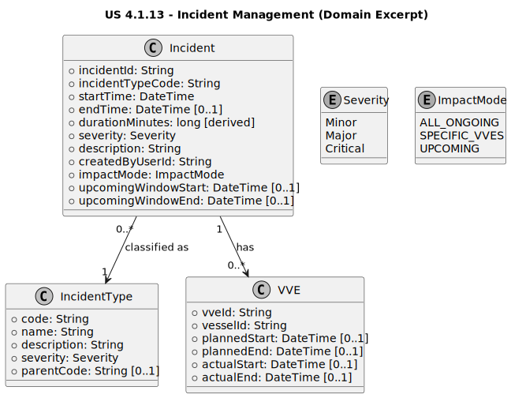

### 2. Analysis

#### 2.1. Relevant Domain Model Excerpt

Within the **Operational Disruptions / Incident Management** bounded context, the core concept introduced/extended by this user story is the **Incident** record and its impact scoping over **VVEs (Vessel Visit Executions)**.

**Aggregate**

**Incident (Aggregate Root)**
Represents an operational disruption event that may be ongoing or resolved, and that can impact multiple VVEs (including VVEs created after the incident is registered while it remains active).

**Attributes**

* `incidentId` (unique, **generated** identifier; format `INC-YYYY-NNNNN`, e.g., `INC-2026-00004`)
* `incidentTypeCode` (required; references **IncidentType** by unique code)
* `startTime` (timestamp)
* `endTime` (optional timestamp; `null` means **Active**)
* `duration` (derived; computed automatically when `endTime` is set)
* `severity` (enum: `Minor | Major | Critical`)
* `description` (free-text)
* `createdByUserId` (required; responsible user/creator)
* `impactMode` (enum: `ALL_ONGOING | SPECIFIC_VVES | UPCOMING`)
* `upcomingWindowStart` (optional; used when `impactMode=UPCOMING`)
* `upcomingWindowEnd` (optional; used when `impactMode=UPCOMING`)

**Relationships**

* `IncidentType 1 ── 0..* Incident` (each Incident references exactly one IncidentType)
* `Incident 1 ── 0..* IncidentAffectedVVE` (association entity)
* `VVE 1 ── 0..* IncidentAffectedVVE` (a VVE can be affected by multiple incidents)

**Key Invariants / Business Rules**

* `incidentId` must follow the generated ID pattern.
* `incidentTypeCode` must reference an existing **IncidentType**.
* `severity` must be one of the supported values.
* If `endTime` is provided, it must be `>= startTime`.
* `impactMode` governs scoping (`ALL_ONGOING`, `SPECIFIC_VVES`, `UPCOMING`).
* The `(incidentId, vveId)` pair must be unique.

#### Domain excerpt (PlantUML class diagram)

---

### 2.2. Other Remarks

* **Persistence approach (MongoDB + Mongoose):**
* Store `Incident` as its own collection.
* `IncidentAffectedVVE` logic is handled via the `vveList` array embedded in the `Incident` document (as decided in implementation).

* **Active impact highlighting:**
* “Active” is defined as `endTime == null`.
* “Impacting” means the incident is active AND the VVE is listed in `vveList` (or implied by `Global` mode).

* **Upcoming VVEs:**
* Operators can add/remove VVEs from the `vveList` at any time while the incident is active, ensuring operational completeness.