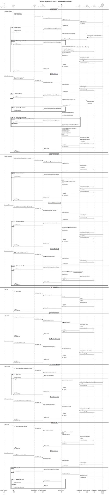
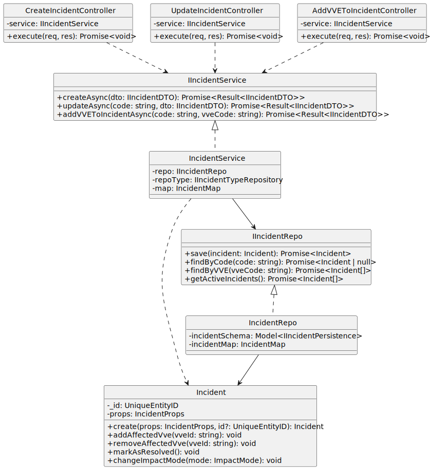

# US 4.1.13 - Record and manage incidents

## 3. Design - User Story Realization

### 3.1. Rationale

**Note:** This realization follows a **Single Action Controller** pattern (one controller per operation) within a layered architecture (Controller -> Service -> Repository).

| Interaction ID | Question: Which class is responsible for... | Answer | Justification (with patterns) |
| --- | --- | --- | --- |
| **Create Incident** | ... interacting with the actor (API client)? | `CreateIncidentController` | **Pure Fabrication**: Handles HTTP request/response handling separately from business logic. |
|  | ... coordinating the creation logic? | `IncidentService` | **Controller / Service Layer**: Orchestrates validation, entity creation, and persistence commands. |
|  | ... generating the unique ID? | `Incident` (Aggregate) | **Information Expert**: The domain entity (or its factory) knows the format and rules for its identity. |
|  | ... persisting the new incident? | `IncidentRepo` | **Repository**: Abstraction for data access layer (Mongoose). |
|  | ... validating the `IncidentType` exists? | `IncidentTypeRepo` | **Repository**: Accesses `IncidentType` aggregate data to ensure referential integrity. |
| **Update Incident** | ... interacting with the actor? | `UpdateIncidentController` | **Pure Fabrication**: Specialized controller for updates. |
|  | ... retrieving the existing incident? | `IncidentRepo` | **Repository**: Finds the aggregate root by its ID/code. |
|  | ... applying changes (severity, impact)? | `Incident` (Aggregate) | **Information Expert / Mutator**: Domain logic for state transitions and invariants (e.g., date checks) resides here. |
| **Add VVE** | ... interacting with the actor? | `AddVVEToIncidentController` | **Pure Fabrication**: Specialized controller for adding VVEs. |
|  | ... validating the VVE exists? | `VVEService` (mock/stub) | **Service**: External service or repository call (depending on bounded context integration). |
|  | ... linking VVE to Incident? | `Incident` (Aggregate) | **Information Expert**: The `Incident` aggregate maintains the `vveList` and ensures uniqueness/invariants. |

### Systematization

According to the taken rationale, the conceptual classes promoted to software classes are:

* **Incident** (Aggregate Root)
* **IncidentType** (Aggregate Root - for validation)

Other software classes (i.e., Pure Fabrication) identified:

* **CreateIncidentController** / **UpdateIncidentController** / **AddVVEToIncidentController** (API Layer)
* **IncidentService** (Application Layer)
* **IncidentRepo** / **IncidentTypeRepo** (Infrastructure/Persistence Layer)
* **IncidentMap** (Data Mapper)
* **IncidentDTO** (Data Transfer Object)

---

## 3.2. Sequence Diagram (SD)

### Full Diagram (Create Incident Scenario)

## 3.3. Class Diagram (CD)

This diagram details the static structure of the classes implemented for this User Story.

