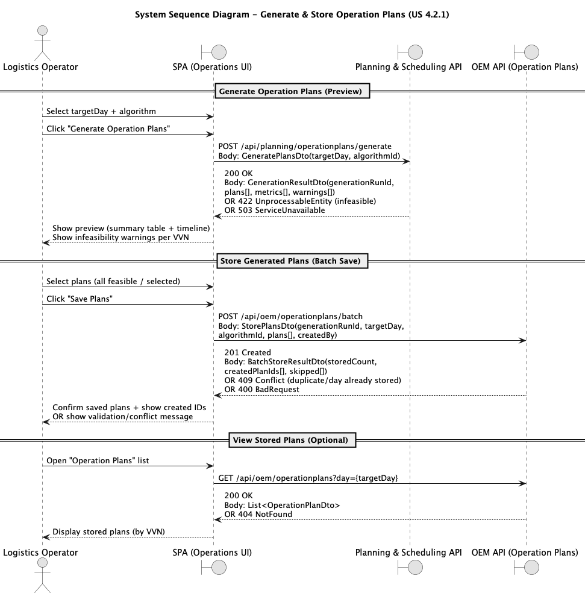

# US.4.2.1 - Operation Plans for all Vessel Visit Notifications

## 1. Requirements Engineering

### 1.1. User Story Description
**As a Logistics Operator**, I want to **automatically generate Operation Plans for all Vessel Visit Notifications (VVNs) scheduled for a given day** using one of the available **scheduling algorithms**, and **store those plans** (after preview) so that cargo operations are efficiently organized and can later be monitored, audited, and adjusted.

---

### 1.2. Customer Specifications and Clarifications
**From the specifications document and client meetings:**
- The system must include a dedicated **Planning & Scheduling** back-end module that exposes planning/scheduling capabilities through a **REST-based API**, consuming data from other modules (e.g., resources, staff).  
- The Planning & Scheduling module **does not persist operational data**; it computes and returns results upon request, using **JSON payloads** and consistent identifiers. 
- The scheduling process is initiated via a dedicated SPA interface that:
  - allows specifying the **target day**,
  - presents results in a **summary table** (vessel, start/end time, assigned crane/staff),
  - and, when feasible, presents results in a **timeline** format,
  - including warnings about infeasibility (e.g., lack of resources/staff). 

**Operational constraints considered by the scheduling computation (baseline):**
- One vessel per dock at a time.
- One crane per unloading/loading operation.
- One storage location for the unloading/loading operations.
- Availability of physical resources (crane) and qualified staff within operational windows.  

**From forum (captured clarifications to avoid ambiguity):**
> **Q:** “Should generated plans be persisted in the Planning & Scheduling module?”  
>
> **A:** No. The Planning & Scheduling module only computes and returns results; persistence must be handled by the relevant operational module (OEM).

> **Q:** “O Operation plan é gerado automaticamente através do módulo de planeamento. No entanto, para o módulo de planeamento conseguir dar a sequência das operações, este tem de ter acesso a que operações executar para cada VVN. Esta lista de operações de uma VVN é registada manualmente? Se sim, quem a preenche e poderia dar exemplos de operações numa VVN?”  
> 
> **A:** As operações advêm dos manifestos de carga (cargo manifest).


> **Q:** “Ao gerar um Operation Plan, duas das informações necessárias são os recursos a serem utilizados e os tempos para o carregamento e descarregamento de carga. Em relação aos tempos, é relevante identificar a que operação da sequência eles pertencem, considerando que as operações são unicamente “loading” e “unloading”? Uma das soluções pensadas foi colocá-los na mesma ordem em que as operações serão realizadas. E, em relação aos recursos, é necessário indicar a que operação pertencem?”  
>
> **A:** Não tenho a certeza de ter percebido completamente o alcance das perguntas colocadas... Ao nível do planeamento de operações é importante saber/conhecer:
> 1. A sequência / ordem de cada operação. E.g., descarregar contentor X, depois o Y e depois o Z;... carregar o contentor K, depois o M, etc...
>
> > 1.1. Devem ter em atenção que é possível executar operações em simultâneo. E.g., se num cais existem 2 gruas, cada uma pode (des)carregar ao mesmo tempo um contentor.
>
> > 1.2. Também devem considerar que pode haver paragens entre operações sequenciais, por exemplo, devido a indisponibilidade de recursos humanos. Nesse sentido, definir a hora inicio/fim previsto de cada operação é importante.
> 2. Os recursos (físicos e humanos) envolvidos em cada operação, de modo a permitir, por exemplo, discriminar:
> >   2.1. Que a grua G1 descarrega o contentor H enquanto a grua G2 descarrega o contentor P.
>
> >   2.2. Que a grua G1 está a ser operada pelo Manuel até às 16h00 mas que daí em diante, até às 23h00, é a Carla que realizar as operações planeadas para essa mesma grua.
> 
> Seja qual for a estrutura de informação adotada, o sistema deveria ser capaz de dar resposta a estas necessidades..
---

### 1.3. Acceptance Criteria
* **AC01 (Day selection):** The Logistics Operator can select a **target day** (date) for which Operation Plans will be generated. 
* **AC02 (Algorithm selection):** The operator can select one of the **available scheduling algorithms** in the SPA. 
* **AC03 (Batch generation):** The system generates an Operation Plan **for each eligible VVN** scheduled for the selected day (or returns an infeasibility reason for VVNs that cannot be planned).
* **AC04 (Plan content):** Each Operation Plan includes, at minimum, the **planned start/end time windows** and the **assigned crane and staff**; it may also include the assigned storage location.   
* **AC05 (SPA preview):** The SPA allows the operator to **initiate generation** and **preview results** before saving, including:
  - a **summary table** (vessel, start/end, crane, staff),
  - and, if feasible, a **timeline view**. 
* **AC06 (Progress + infeasibility feedback):** During generation, the SPA provides feedback on progress/completion and shows **warnings** about infeasibility (e.g., lack of resources or staff).  
* **AC07 (Persistence in OEM):** After preview, the operator can **save** generated plans into the OEM module (store as Operation Plans linked to each VVN), so they become available for later execution monitoring and auditing.
* **AC08 (Audit metadata):** For each stored plan, the system records metadata including **creation timestamp**, **author**, and **algorithm used**.
* **AC09 (API + payload consistency):** Requests/responses use **JSON** and consistent cross-module identifiers (e.g., resource IDs). 

---

### 1.4. Found out Dependencies
* **Planning & Scheduling module (REST API; compute-only)**   
* **VVN management** (VVN must exist and be scheduled/eligible for the selected day; typically approved with dock assignment).
* **Staff module** (qualified staff with operational windows)   
* **Physical Resources module** (cranes/equipment with availability and qualification requirements)   
* **Qualifications** (must exist to associate staff/resources consistently)   
* **SPA** (dedicated UI to trigger scheduling and display results)  
* **IAM / Authorization** (operator must be authenticated/authorized to run planning and store plans).

---

### 1.5. Input and Output Data

**Input Data:**
- `targetDay` (date) selected by the Logistics Operator.  
- `algorithmId` (selected scheduling algorithm).  
- Optional `algorithmParams` (if supported by the chosen algorithm).
- Authentication context (access token / user identity; used to identify “author” when storing).
- Operational data consumed by the scheduling computation (retrieved by Planning & Scheduling via APIs):
  - VVNs scheduled for the day,
  - dock availability constraints,
  - physical resources availability and requirements, 
  - staff availability and qualifications. 

**Output Data (Preview from Planning & Scheduling):**
- `generationRunId` (identifier of the generation execution; recommended).
- For each VVN:
  - `vvnId`, vessel reference, dock reference (if applicable),
  - planned operation windows (`startTime`, `endTime`),
  - assigned crane/resource id and assigned staff id,   
  - (optional) assigned storage location,
  - feasibility flag + infeasibility reason (if not feasible).   
- Summary metrics for comparison (e.g., total delay, computation time), especially when multiple algorithms are available. 

**Output Data (Stored in OEM):**
- Created `operationPlanId` per stored plan (linked to `vvnId`).
- Stored audit metadata: `createdAt`, `createdBy`, `algorithmId`.

---

### 1.6. System Sequence Diagram (SSD)

#### SSD (Mermaid sequence diagram – ready to paste in your report)


---

### 1.7. Other Relevant Remarks

* The Planning & Scheduling module is **compute-only** (no persistence). Therefore, **OEM must be the persistence boundary** for Operation Plans.
* The SPA should present results both as a **summary table** and, if feasible, as a **timeline**, and must provide clear **infeasibility feedback** (resource/staff constraints).
* To support operational auditability and traceability, it is recommended to store a `generationRunId` (or equivalent) alongside the persisted plan batch, in addition to the minimum metadata (author, timestamp, algorithm).
* Where alternative algorithms exist, the UI should allow operators to compare key summary metrics (e.g., total delay, compute time) to support decision-making.

```
