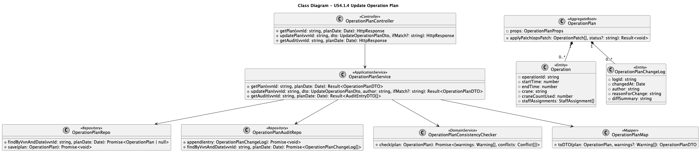

## 3. Design – User Story Realization (US4.1.4)

### 3.1. Rationale

***Note that SSD – Alternative One is adopted.***

| Interaction ID | Question: Which class is responsible for...                      | Answer                                                                                      | Justification (with patterns)                                                                                                                                        |
| -------------: | ---------------------------------------------------------------- | ------------------------------------------------------------------------------------------- | -------------------------------------------------------------------------------------------------------------------------------------------------------------------- |
|         Step 1 | … interacting with the actor (HTTP request/response)?            | `OperationPlanController`                                                                   | **Controller** (GRASP) to handle REST interaction, keep application logic out of the transport layer.                                                                |
|                | … coordinating the use case?                                     | `OperationPlanService`                                                                      | **Application Service** (DDD) / **Controller** (GRASP) coordination role; ensures orchestration, transactions, and sequencing.                                       |
|         Step 2 | … validating request payload (DTO constraints)?                  | `OperationPlanController` (syntactic) + `OperationPlan` / `OperationPlanService` (semantic) | Split validation: **Pure Fabrication** for input schema checks in controller; **Information Expert** for invariants in domain/service (e.g., `startTime < endTime`). |
|         Step 3 | … loading the current plan for the VVN?                          | `OperationPlanRepo`                                                                         | **Repository** abstracts persistence and query logic; **Low Coupling** between service and DB technology (Mongo/Mongoose).                                           |
|         Step 4 | … applying the manual changes to the plan?                       | `OperationPlan` (and `Operation` entity)                                                    | **Aggregate Root** ensures internal consistency; **Information Expert** over plan state and invariants.                                                              |
|         Step 5 | … detecting conflicts with other VVNs and resource availability? | `OperationPlanConsistencyChecker`                                                           | **Domain Service** for cross-aggregate rules; **Protected Variations** isolates conflict logic from application flow.                                                |
|         Step 6 | … persisting the updated plan?                                   | `OperationPlanRepo`                                                                         | **Repository** persists the aggregate; supports optimistic concurrency (e.g., version/ETag).                                                                         |
|         Step 7 | … logging date/author/reason and change details?                 | `OperationPlanAuditRepo` (or `AuditLogRepo`)                                                | **Pure Fabrication** for audit trail storage; keeps audit concerns decoupled from core aggregate while meeting traceability requirements.                            |
|         Step 8 | … mapping domain objects to response DTO?                        | `OperationPlanMap`                                                                          | **Mapper / Data Mapper** pattern to avoid leaking persistence/domain structures into API contracts.                                                                  |

#### Systematization

According to the taken rationale, the conceptual classes promoted to software classes are:

* `OperationPlan` (Aggregate Root)
* `Operation` (Entity inside the aggregate)
* `OperationPlanChangeLog` (Entity/Record for audit trail) **or** external audit model
* (Referenced context) `VVN`, `Dock`, `Crane`, `StaffMember` (as needed for conflict checks)

Other software classes (i.e., Pure Fabrication) identified:

* `OperationPlanController`
* `OperationPlanService`
* `OperationPlanRepo`
* `OperationPlanConsistencyChecker`
* `OperationPlanAuditRepo` (or `AuditLogRepo`)
* `OperationPlanMap` (mapper)

---

### 3.2. Sequence Diagram (SD)

#### Full Diagram (PlantUML)

---

### 3.3. Class Diagram (CD)

