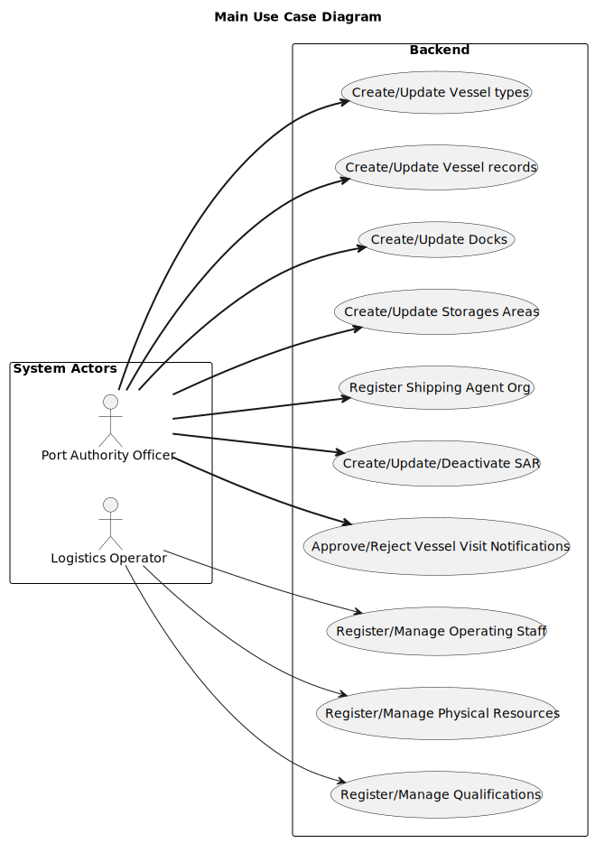
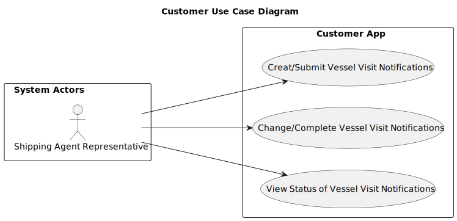

# Main Use Case Diagram (UCD)

# Customer Use Case Diagram (UCD)

# Use Cases / User Stories

| Task - US'S Back-end Module(s)                          | Sprint A            | Sprint B | Sprint C |
|---------------------------------------------------------|---------------------|----------|----------|
| [US-2.2.1](../../Sprint1/Back-end-Module(s)/US-2.2.1)   | 1231274 & 1230444   |          |          |
| [US-2.2.2](../../Sprint1/Back-end-Module(s)/US-2.2.2)   | 1231274             |          |          |
| [US-2.2.3](../../Sprint1/Back-end-Module(s)/US-2.2.3)   | 1230444             |          |          |
| [US-2.2.4](../../Sprint1/Back-end-Module(s)/US-2.2.4)   | All Members         |          |          |
| [US-2.2.5](../../Sprint1/Back-end-Module(s)/US-2.2.5)   | 1211225             |          |          |
| [US-2.2.6](../../Sprint1/Back-end-Module(s)/US-2.2.6)   | 1211225             |          |          |
| [US-2.2.7](../../Sprint1/Back-end-Module(s)/US-2.2.7)   | All Members         |          |          |
| [US-2.2.8](../../Sprint1/Back-end-Module(s)/US-2.2.8)   | All Members         |          |          |
| [US-2.2.9](../../Sprint1/Back-end-Module(s)/US-2.2.9)   | All Members         |          |          |
| [US-2.2.10](../../Sprint1/Back-end-Module(s)/US-2.2.10) | All Members         |          |          |
| [US-2.2.11](../../Sprint1/Back-end-Module(s)/US-2.2.11) | 1230564             |          |          |
| [US-2.2.12](../../Sprint1/Back-end-Module(s)/US-2.2.12) | 1230839             |          |          |
| [US-2.2.13](../../Sprint1/Back-end-Module(s)/US-2.2.13) | 1230839 & 1230564   |          |          |

| Task - US'S Project Client Analysis                        | Sprint A       | Sprint B | Sprint C |
|------------------------------------------------------------|----------------|----------|----------|
| [US-2.3.1](../../Sprint1/Project-Client-Analysis/US-2.3.1) | All Members    |          |          |
| [US-2.3.2](../../Sprint1/Project-Client-Analysis/US-2.3.2) | All Members    |          |          |
| [US-2.3.3](../../Sprint1/Project-Client-Analysis/US-2.3.3) | All Members    |          |          |
| [US-2.3.4](../../Sprint1/Project-Client-Analysis/US-2.3.4) | All Members    |          |          |
| [US-2.3.5](../../Sprint1/Project-Client-Analysis/US-2.3.5) | All Members    |          |          |
| [US-2.3.6](../../Sprint1/Project-Client-Analysis/US-2.3.6) | All Members    |          |          |
| [US-2.3.7](../../Sprint1/Project-Client-Analysis/US-2.3.7) | All Members    |          |          |